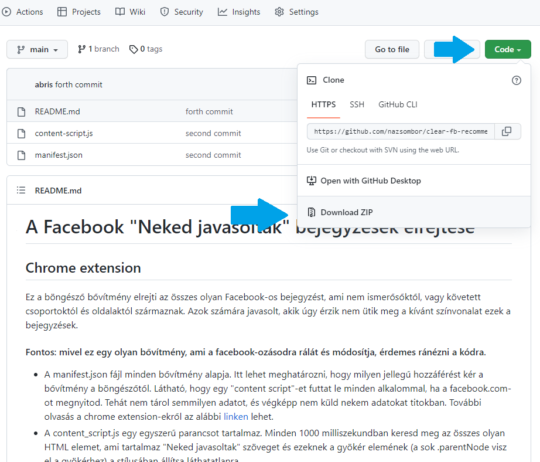
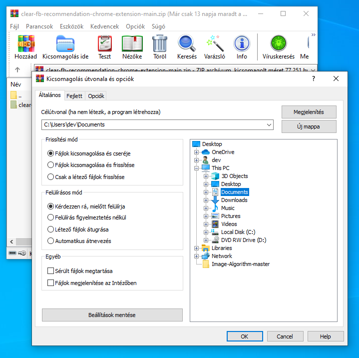
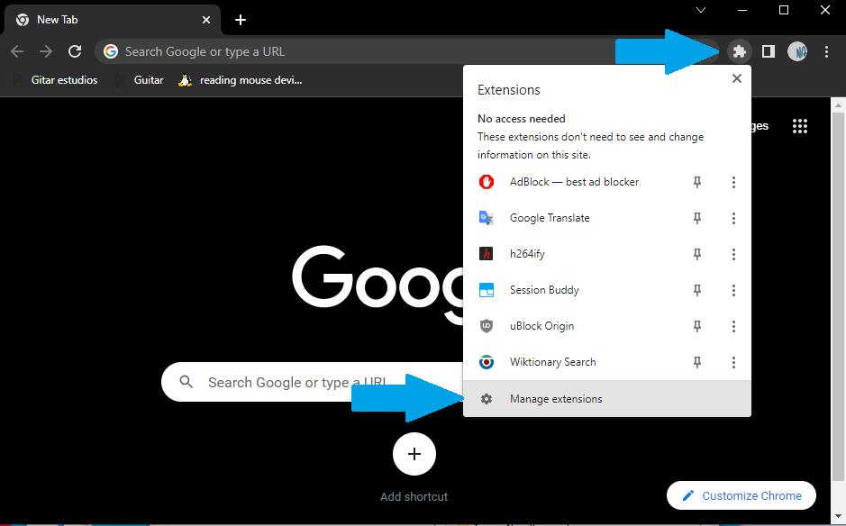
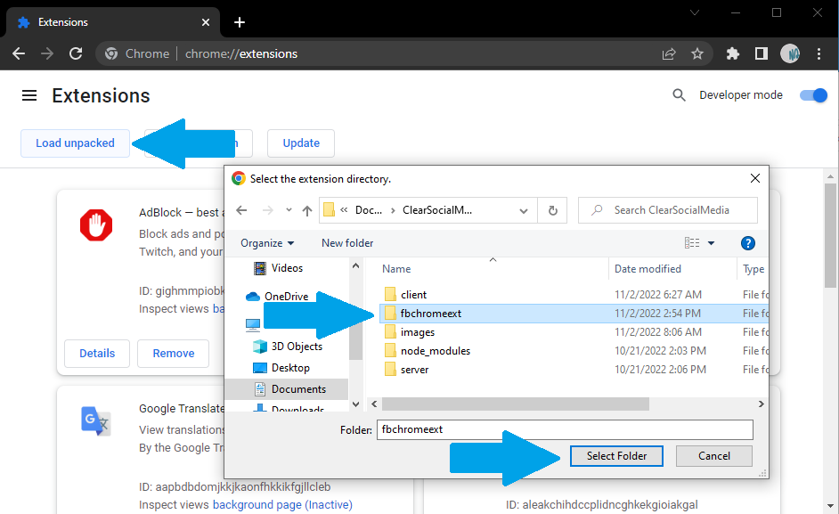

### UPUDATE: Nényány bejegyzés típus miatt megakadt és az utána jövő hirdetéseket nem tudta elrejteni. Ezek most javítva lettek és bár így se okozott látható lassulást a sok görgetés, most ez sem okoz már sebesség változást 

# A Facebook "Neked javasoltak" bejegyzések és hirdetések elrejtése
## Chrome extension
Ez a böngésző bővítmény elrejti az összes olyan Facebook-os bejegyzést, ami nem ismerősőktől, vagy követett csoportoktól és oldalaktól származnak, illetve a hirdetéseket. Azok számára javasolt, akik úgy érzik nem ütik meg a kívánt színvonalat ezek a bejegyzések.

#### Fontos: mivel ez egy olyan bővítmény, ami a facebook-ozásodra rálát és módosítja, érdemes ránézni a kódra.

- A manifest.json fájl minden bővítmény alapja. Itt lehet meghatározni, hogy milyen jellegű hozzáférést kér a bővítmény a böngészőtől. Látható, hogy egy "content script"-et futtat le minden alkalommal, ha a facebook.com-ot megnyitod. Tehát nem tárol semmilyen adatot, és végképp nem küld nekem adatokat titokban. További olvasás a chrome extension-ekről az alábbi [linken](https://developer.chrome.com/docs/extensions/mv3/manifest/) lehet.
- A content_script.js minden 1000 milliszekundban megkeresi a hírfolyambejegyzéseket és aminek a fejléce "Neked javasoltak" szövegű vagy hirdetés, azt láthatatlanná teszi.

### Telepítés

1. Tömörített mappa letöltése

2. Kicsomagolás egy helyre, ahol bármikor elérhető

3. Hozzáadás a Chrome böngészőhöz

Innentől csak frissíteni kell a facebook oldalad és kész is!
